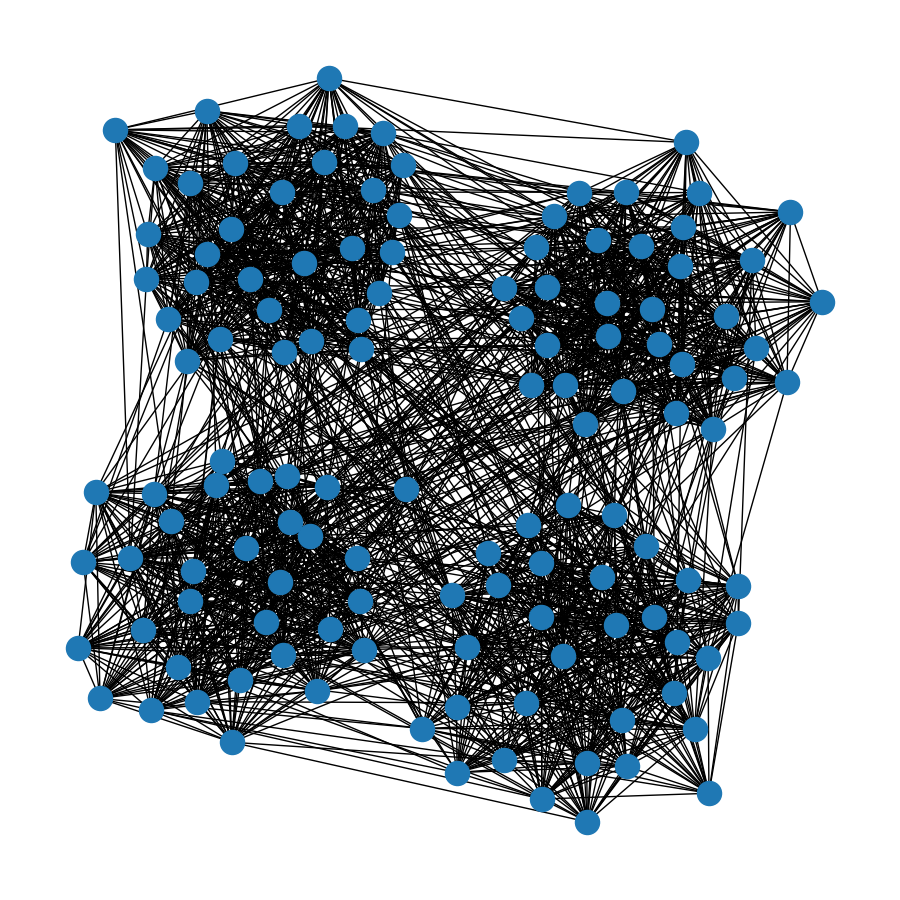
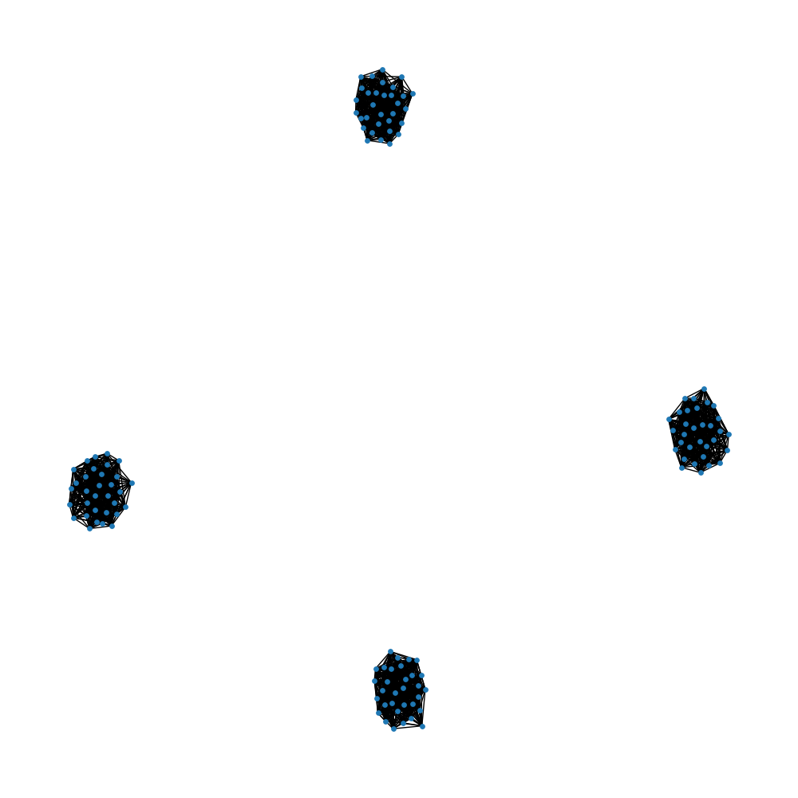
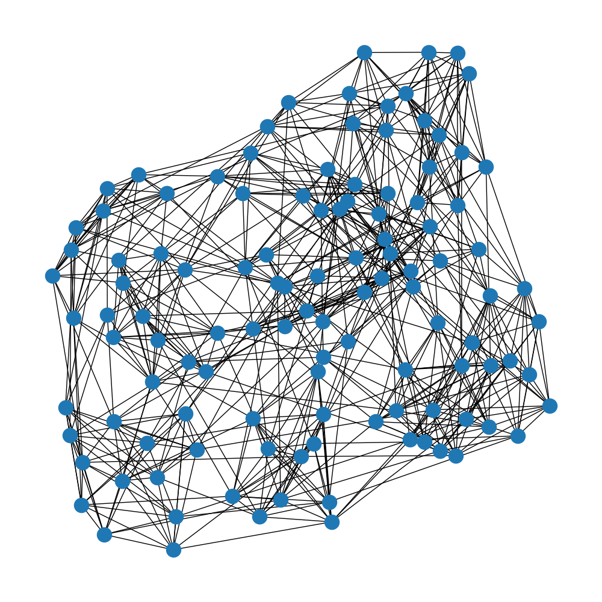
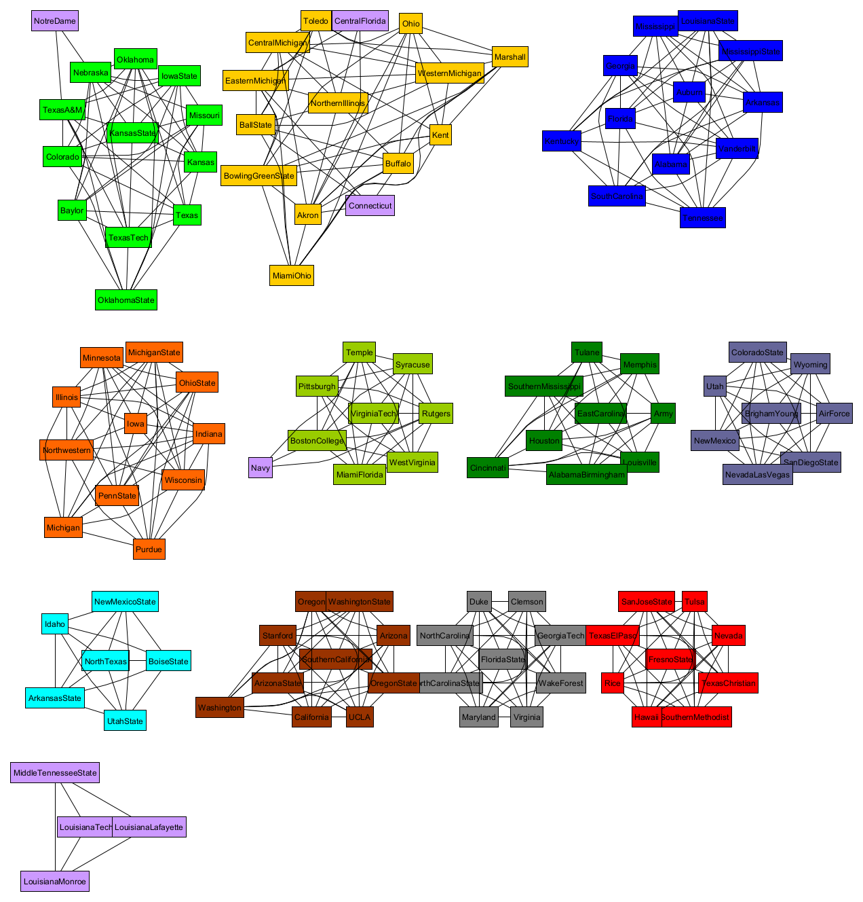

## Programming Assignment 03
####Maddie Hulcy and Jay Kynerd

Problem: _given a graph, implement the Girvan-Newman algorithm to determine communities within the graph_

We implemented the Girvan-Newman algorithm according to the pseudocode provided in their paper, “Community structure in social and biological networks".
First, we calculated edge betweenness centrality for every edge in the graph using the Brandes algorithm. Following this algorithm, we implemented a breadth-first-search to determine the distance and number of shortest paths from each vertex to all other vertices in the graph. Then, the vertices were visited in reverse order from leaves to source by popping off a stack, and dependencies and centrality betweenness were accumulated.
Once edge betweenness centrality was calculated for each edge in the graph, edges with the highest betweenness centrality were removed until distinct communities were formed. 

We tested our implemenation using graphs randomly generated using Python's `NetworkX` library. Four subgraphs representing communities were created, and the nodes were connected within the community randomly with probability `p_in` and with other communities with probability `p_out`. We selected the values `p_in = .55` and `p_out = .04`, which yields an average node degree of 16 for graphs of size 128. 

_Figure 1: example randomly generated graph_

After running Girvan-Newman on the graph, the graph shows 4 distinct communities:

_Figure 2: graph after running Girvan-Newman algorithm_

We further confirmed the accuracy of our implementation with a dataset of college football teams, using the Girvan-Newman algorithm to determine each team's conference.

_Figure 3: A graphical representation of games played by college football teams (each node represents a team, and each edge represents a game played between two teams)._

_Figure 4: After running the Girvan-Newman algorithm, the teams were organized into communities by their conferences, as depicted above. Note that each color represents a conference, and purple teams are independent and do not fit into a specific conference._

